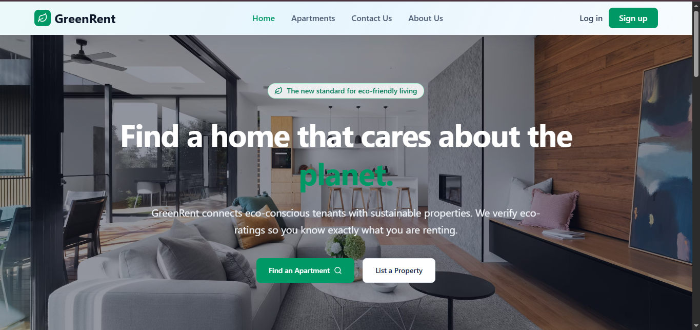
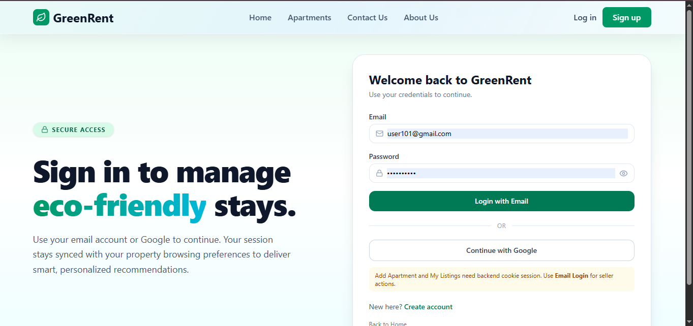
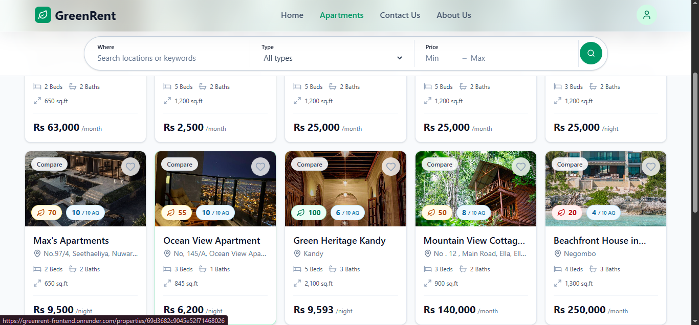
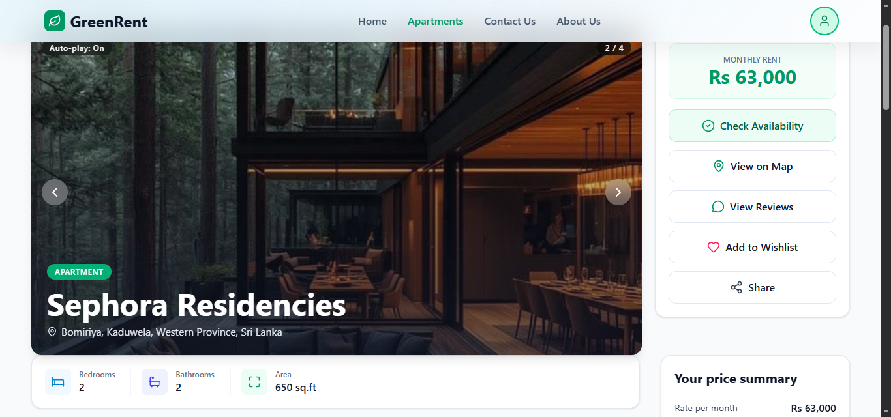
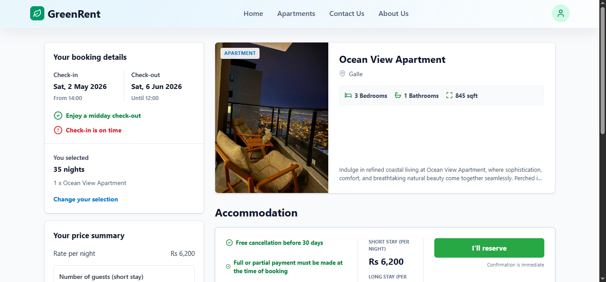
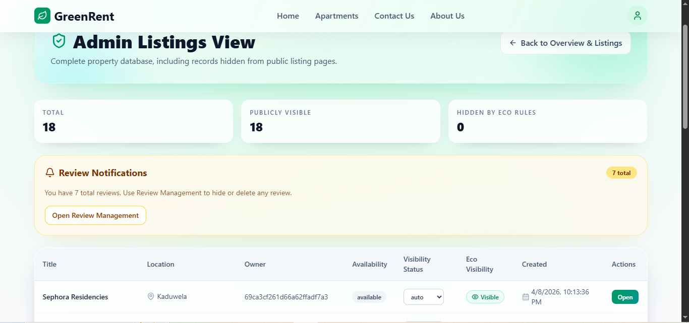

# GreenRent

**Classification:** Public-SLIIT

GreenRent is a Node.js, Express, and MongoDB-based web application for sustainable apartment discovery. It supports property listings, eco-rating management, bookings, renter reviews, recommendations, chat, and authentication.

## Project Structure

```text
GreenRent/
├── client/   # React frontend
├── server/   # Express REST API
├── postman/  # API collections
└── README.md
```

## Setup Instructions

### Prerequisites

- Node.js 18+ recommended
- npm
- MongoDB Atlas connection string or local MongoDB
- A valid `.env` file in `server/`

### 1. Clone or open the project

Open the repository root:

```powershell
cd D:\GitDesktop\GreenRent
```

### 2. Configure the backend environment

Create `server/.env` with the required values:

```env
MONGODB_URI=your_mongodb_connection_string
JWT_SECRET=your_jwt_secret
NODE_ENV=development
CLIENT_URL=http://localhost:5173
SENDER_EMAIL=your_email@example.com
SMTP_USER=your_smtp_user
SMTP_PASS=your_smtp_password
GEMINI_API_KEY=your_gemini_api_key
```

Optional test or local-only values may also be used depending on your setup.

### 3. Install backend dependencies

```powershell
cd server
npm install
```

### 4. Start the backend server

```powershell
npm run dev
```

The API runs on:

```text
http://localhost:5000
```

### 5. Install frontend dependencies

Open a new terminal and run:

```powershell
cd client
npm install
```

### 6. Start the frontend

```powershell
npm run dev
```

The frontend runs on Vite, usually at:

```text
http://localhost:5173
```

### 7. Optional utilities

From `server/`:

```powershell
npm run generate-tokens
```

This prints sample JWTs for testing, but note that tokens must match real database users for protected routes that load user records from MongoDB.

## Authentication

The API supports authentication through either:

- Cookie token set during login/register
- `Authorization: Bearer <token>` header

Role-based access control is used on protected routes.

Typical roles:

- `user` or `renter`
- `seller` or `landlord`
- `admin`

## API Base URL

```text
http://localhost:5000/api
```

## Common Response Formats

### Success

```json
{
  "success": true,
  "message": "..."
}
```

### Validation error

```json
{
  "errors": ["..."]
}
```

### Standard error

```json
{
  "message": "..."
}
```

---

# API Endpoint Documentation

## 1. Auth API

Base path: `/api/auth`

### POST `/api/auth/register`
Create a new user account.

Authentication: Not required

Request body:

```json
{
  "name": "Jane Renter",
  "email": "jane@example.com",
  "password": "password123"
}
```

Success response `201`:

```json
{
  "success": true,
  "message": "User registered successfully",
  "token": "jwt-token-here"
}
```

Error response `400`:

```json
{
  "success": false,
  "message": "...",
  "errors": ["..."]
}
```

### POST `/api/auth/login`
Login an existing user.

Authentication: Not required

Request body:

```json
{
  "email": "jane@example.com",
  "password": "password123"
}
```

Success response `200`:

```json
{
  "success": true,
  "message": "Login successful",
  "token": "jwt-token-here"
}
```

### POST `/api/auth/google-login`
Google/social login.

Authentication: Not required

Request body:

```json
{
  "email": "jane@example.com",
  "name": "Jane Renter",
  "avatar": "https://example.com/avatar.png"
}
```

Success response `200`:

```json
{
  "success": true,
  "message": "Google login successful",
  "token": "jwt-token-here",
  "user": {
    "name": "Jane Renter",
    "email": "jane@example.com",
    "role": "user",
    "avatar": "https://example.com/avatar.png",
    "isPreferenceSet": false
  }
}
```

### POST `/api/auth/logout`
Clear the auth cookie.

Authentication: Not required

Success response `200`:

```json
{
  "success": true,
  "message": "Logged out successfully"
}
```

### POST `/api/auth/request-seller`
Submit a seller application.

Authentication: Required

Request body:

```json
{
  "sellerName": "Jane Seller",
  "businessName": "Green Homes",
  "contactNumber": "0771234567",
  "sellingPlan": "personal_property"
}
```

Success response `200`:

```json
{
  "success": true,
  "message": "Seller application submitted successfully"
}
```

### PATCH `/api/auth/approve-seller/:id`
Approve a user as seller.

Authentication: Required, `admin`

Success response `200`:

```json
{
  "success": true,
  "message": "Seller approved successfully"
}
```

---

## 2. User API

Base path: `/api/user`

### GET `/api/user/data`
Get the current logged-in user's profile.

Authentication: Required

Success response `200`:

```json
{
  "success": true,
  "user": {
    "_id": "...",
    "name": "Jane Renter",
    "email": "jane@example.com"
  }
}
```

### GET `/api/user/admin/seller-requests`
List pending seller requests.

Authentication: Required, `admin`

### GET `/api/user/public/:userId`
Get a public seller profile.

Authentication: Not required

### GET `/api/user/wishlist`
Get the current user's wishlist.

Authentication: Required

### GET `/api/user/wishlist/check/:propertyId`
Check whether a property is in the wishlist.

Authentication: Required

### POST `/api/user/wishlist/:propertyId`
Add a property to the wishlist.

Authentication: Required

### DELETE `/api/user/wishlist/:propertyId`
Remove a property from the wishlist.

Authentication: Required

---

## 3. Recommendation API

Base path: `/api/recommendations`

### GET `/api/recommendations/mobility-check`
Check mobility/transit information for a location.

Authentication: Not required

### GET `/api/recommendations`
Get recommendations for the authenticated user.

Authentication: Required

### GET `/api/recommendations/ai-insight/:propertyId`
Get one AI insight for a property.

Authentication: Required

### GET `/api/recommendations/preferences`
Get current user preferences.

Authentication: Required

### PUT `/api/recommendations/preferences`
Save or update preferences.

Authentication: Required

Request body example:

```json
{
  "location": "Colombo",
  "budgetMin": 30000,
  "budgetMax": 80000,
  "ecoPriority": "high",
  "propertyType": "apartment",
  "transportPreference": "Any",
  "greenAmenities": ["solarPanels", "ledLighting"]
}
```

### DELETE `/api/recommendations/preferences`
Reset preferences.

Authentication: Required

---

## 4. Property API

Base path: `/api/properties`

### GET `/api/properties`
Get all properties.

Authentication: Not required

Query parameters supported:

- `search`
- `propertyType`
- `availabilityStatus`
- `ownerId`
- `minPrice`
- `maxPrice`
- `sortBy`
- `sortOrder`
- `limit`
- `skip`
- `includeHidden` (admin only, requires auth)

Success response `200`:

```json
[
  {
    "_id": "...",
    "title": "Eco Apartment",
    "price": 85000
  }
]
```

### GET `/api/properties/:id`
Get one property by ID.

Authentication: Not required

Success response `200`:

```json
{
  "_id": "...",
  "title": "Eco Apartment",
  "description": "..."
}
```

### GET `/api/properties/:id/nearby`
Get nearby places for a property.

Authentication: Not required

Success response `200`:

```json
{
  "source": "live",
  "places": {
    "busStops": [],
    "groceries": [],
    "hospitals": [],
    "schools": []
  }
}
```

### POST `/api/properties`
Create a property listing.

Authentication: Required, `seller` or `admin`

Request body example:

```json
{
  "title": "Eco Apartment",
  "description": "A modern eco-friendly apartment.",
  "location": {
    "address": "123 Green Street",
    "displayAddress": "123 Green Street, Colombo",
    "city": "Colombo",
    "state": "Western Province",
    "country": "Sri Lanka",
    "coordinates": { "lat": 6.9271, "lng": 79.8612 }
  },
  "price": 85000,
  "stayType": "long",
  "monthlyPrice": 85000,
  "dailyPrice": 5000,
  "area": 1200,
  "bedrooms": 2,
  "bathrooms": 1,
  "maxGuests": 4,
  "parking": true,
  "propertyType": "apartment",
  "ecoFeatures": {
    "solarPanels": true,
    "ledLighting": true,
    "waterSavingTaps": true,
    "recyclingAvailable": true
  },
  "images": ["https://example.com/property.jpg"]
}
```

Success response `201`:

```json
{
  "_id": "...",
  "title": "Eco Apartment"
}
```

### PUT `/api/properties/:id`
Update a property listing.

Authentication: Required, owner or `admin`

### PUT `/api/properties/:id/clear-eco-rating`
Clear the current eco rating linked to the property.

Authentication: Required, owner or `admin`

### DELETE `/api/properties/:id`
Delete a property listing.

Authentication: Required, owner or `admin`

### DELETE `/api/properties/delete-all`
Delete all properties.

Authentication: Required, `admin`

---

## 5. Eco-Rating API

Base path: `/api/eco-ratings`

### GET `/api/eco-ratings`
List eco ratings.

Authentication: Not required

Query parameters:

- `listingId`

### GET `/api/eco-ratings/:id`
Get one eco rating.

Authentication: Not required

### POST `/api/eco-ratings`
Create an eco rating.

Authentication: Required, `seller`, `landlord`, or `admin`

Request body example:

```json
{
  "listingId": "property-id",
  "location": {
    "latitude": 6.9271,
    "longitude": 79.8612,
    "address": "Colombo 03, Sri Lanka"
  },
  "criteria": {
    "energyRating": "A",
    "solarPanels": true,
    "ledLighting": true,
    "efficientAc": true,
    "waterSavingTaps": true,
    "rainwaterHarvesting": false,
    "waterMeter": true,
    "recyclingAvailable": true,
    "compostAvailable": false,
    "transportDistance": "< 1 km",
    "evCharging": false,
    "goodVentilationSunlight": true
  },
  "evidenceLinks": ["https://example.com/evidence-1.jpg"],
  "notes": "Initial eco profile"
}
```

Success response `201`:

```json
{
  "_id": "...",
  "listingId": "...",
  "totalScore": 85
}
```

### PUT `/api/eco-ratings/:id`
Update an eco rating.

Authentication: Required, `seller`, `landlord`, or `admin`

### DELETE `/api/eco-ratings/:id`
Delete an eco rating.

Authentication: Required, `admin`

---

## 6. Booking API

Base path: `/api/bookings`

### POST `/api/bookings/check-availability`
Check if an apartment is available.

Authentication: Not required

Request body:

```json
{
  "apartmentId": "property-id",
  "checkInDate": "2026-04-10T00:00:00.000Z",
  "checkOutDate": "2026-04-12T00:00:00.000Z"
}
```

Success response `200`:

```json
{
  "available": true
}
```

### POST `/api/bookings`
Create a booking.

Authentication: Required

Request body:

```json
{
  "apartmentId": "property-id",
  "stayType": "short",
  "checkInDate": "2026-04-10T00:00:00.000Z",
  "checkOutDate": "2026-04-12T00:00:00.000Z",
  "numberOfGuests": 2
}
```

Success response `201`:

```json
{
  "message": "Booking created successfully",
  "booking": {
    "_id": "..."
  }
}
```

### GET `/api/bookings/my`
Get the authenticated user's bookings.

Authentication: Required

### GET `/api/bookings/:id`
Get one booking.

Authentication: Required

### PUT `/api/bookings/:id`
Update a booking.

Authentication: Required

### PUT `/api/bookings/:id/payment`
Update payment status.

Authentication: Required

Request body:

```json
{
  "paymentStatus": "paid"
}
```

### PUT `/api/bookings/:id/expire`
Expire a booking if payment timed out.

Authentication: Required

### PUT `/api/bookings/:id/cancel`
Cancel a booking.

Authentication: Required

Request body:

```json
{
  "cancellationReason": "Change of plans"
}
```

### PUT `/api/bookings/:id/refund-request`
Request a refund.

Authentication: Required

Request body:

```json
{
  "refundReason": "Service issue"
}
```

### GET `/api/bookings`
Get all bookings.

Authentication: Required, `admin`

### PUT `/api/bookings/:id/status`
Update booking status.

Authentication: Required, `admin` or `landlord`

Request body:

```json
{
  "status": "confirmed"
}
```

### PUT `/api/bookings/:id/refund`
Approve/process a refund.

Authentication: Required, `admin`

### PUT `/api/bookings/:id/refund/reject`
Reject a refund request.

Authentication: Required, `admin`

### DELETE `/api/bookings/:id`
Delete a booking.

Authentication: Required, `admin`

---

## 7. Renter Review API

Base path: `/api/renter-reviews`

### GET `/api/renter-reviews/listing/:listingId`
Get reviews for a property listing.

Authentication: Not required

### GET `/api/renter-reviews/listing/:listingId/averages`
Get average review statistics for a listing.

Authentication: Not required

### GET `/api/renter-reviews/eco-rating/:ecoRatingId`
Get reviews linked to an eco rating.

Authentication: Not required

### GET `/api/renter-reviews/admin/list`
Get all reviews for moderation.

Authentication: Required, `admin`

### GET `/api/renter-reviews/:id`
Get one review.

Authentication: Not required

### POST `/api/renter-reviews/:id/helpful`
Mark a review as helpful.

Authentication: Not required

### POST `/api/renter-reviews/:id/replies`
Add a reply to a review.

Authentication: Required, `renter`, `user`, `seller`, or `admin`

Request body:

```json
{
  "text": "Thanks for the feedback"
}
```

### DELETE `/api/renter-reviews/:id/replies/:replyId`
Delete a reply.

Authentication: Required, `renter`, `user`, `seller`, or `admin`

### POST `/api/renter-reviews`
Create a renter review.

Authentication: Required, `renter` or `user`

Request body example:

```json
{
  "listingId": "property-id",
  "ecoRatingId": "eco-rating-id",
  "criteria": {
    "energyEfficiency": 5,
    "waterEfficiency": 4,
    "wasteManagement": 5,
    "transitAccess": 4,
    "greenAmenities": 5
  },
  "verification": {
    "solarPanels": true,
    "ledLighting": true
  },
  "review": "Great sustainable apartment.",
  "livingDuration": "< 3 months",
  "wouldRecommend": true
}
```

### GET `/api/renter-reviews/my/reviews`
Get the authenticated user's reviews.

Authentication: Required, `renter` or `user`

### PUT `/api/renter-reviews/:id`
Update a review.

Authentication: Required, `renter`, `user`, or `admin`

### DELETE `/api/renter-reviews/:id`
Delete a review.

Authentication: Required, `renter`, `user`, or `admin`

### PATCH `/api/renter-reviews/:id/status`
Update review moderation status.

Authentication: Required, `admin`

---

## 8. Chat API

Base path: `/api/chat`

### GET `/api/chat/contacts`
Get chat contacts.

Authentication: Required, `seller` or `admin`

### GET `/api/chat/messages`
Get chat messages.

Authentication: Required, `seller` or `admin`

### POST `/api/chat/messages`
Send a chat message.

Authentication: Required, `seller` or `admin`

Request body example:

```json
{
  "recipientId": "user-id",
  "message": "Hello, your booking is confirmed."
}
```

### POST `/api/chat/broadcast`
Send a broadcast message.

Authentication: Required, `admin`

Request body example:

```json
{
  "message": "System maintenance tonight at 10 PM."
}
```

---

## Error Handling

Common HTTP status codes used by the API:

- `200` OK
- `201` Created
- `400` Bad Request
- `401` Unauthorized
- `403` Forbidden
- `404` Not Found
- `409` Conflict
- `500` Server Error

## Testing Notes

- Use `Authorization: Bearer <token>` for protected routes.
- Some seller/admin routes require a real database user with the matching role.
- Property creation may trigger geocoding and can be slower under load.

## Testing

GreenRent includes automated tests for both the backend and frontend, plus optional performance benchmarks.

### Backend Tests

Run backend unit, integration, and API tests from `server/`:

```powershell
cd server
npm test
```

This covers the Express API, controllers, services, routes, and integration scenarios used in the project.

### Frontend Tests

Run frontend component tests from `client/`:

```powershell
cd client
npm test
```

This runs the React test suite for the UI components and page-level behavior.

### Performance Tests

The repository also includes Artillery performance files in the project root. Run them from the root folder after setting any required environment variables.

Examples:

```powershell
artillery run performance-auth.yml
artillery run performance-booking.yml
artillery run performance-eco-rating.yml
artillery run performance-property-test.yml
```

Some write-path benchmarks require valid JWTs for real database users, especially for seller/admin routes.

## Deployment

### Frontend
Platform: Render  
Live URL: https://greenrent-frontend.onrender.com/

### Backend
Platform: Render  
Live URL: https://greenrent-gakv.onrender.com/

### Notes
- Environment variables configured securely
- Frontend connected to deployed backend API


## Useful Commands

### Backend

```powershell
cd server
npm install
npm run dev
npm test
```

### Frontend

```powershell
cd client
npm install
npm run dev
npm test
```

## Assignment Notes

This project includes property search, eco-rating, booking, renter review, recommendation, chat, and authentication flows. The API documentation above is organized to support assignment submission and grading.

# Screenshots







